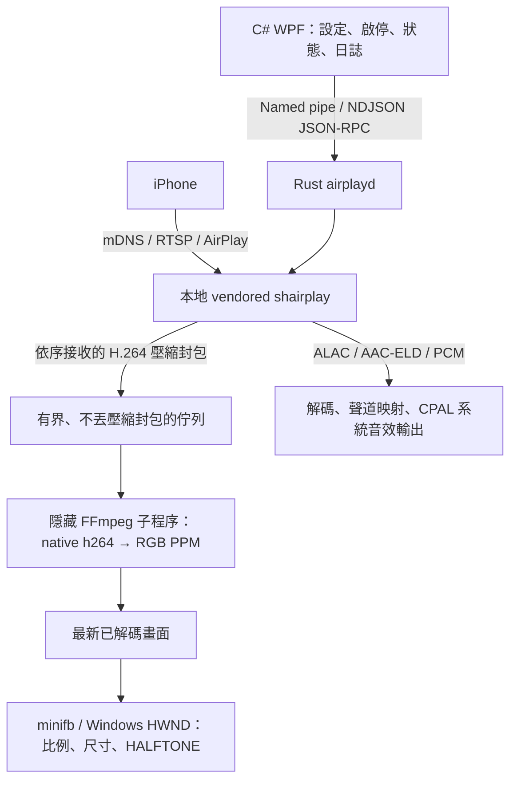

# UxPlayRs 開發、問題排查與安裝打包紀錄

- 紀錄日期：2026-10-09，時區 Asia/Taipei。
- 專案：`D:\Github\uxplay-windows`，重寫版位於 `rewrite/`。
- 本次核對的原始碼提交：`28b360d3fa3b43bd9b97985e0d5e62f9ee2ca313`。
- 資料來源：本次開發對話、Git 提交、現存程式碼、原始改善計畫、MSI receipt 與驗證紀錄。
- 範圍：從 Rust／WPF 重寫架構，到播放尺寸、連線生命週期、停格、音訊、畫質、FFmpeg 切換，以及 MSI 0.1.0／0.1.1。未保留的早期選型理由不以推測補寫。

## 1. 最後確認的狀態

正式播放路徑已改用 **FFmpeg 原生 H.264 解碼器**。使用者重新連線、播放並測試旋轉後回覆：「畫面流暢、顏色正常，也有聲音」。這是當次實體 iPhone 與電腦的使用者確認，不代表所有手機、長時間連線或硬體加速效能都已驗證。

播放視窗內已有小／中／大／符合螢幕選單，預設中等，保留比例；旋轉保留選擇，尺寸切換不重新建立 AirPlay 連線。選擇保留於本次接收器執行期間，未宣稱跨程式重啟持久保存。

Windows x64 MSI **0.1.1** 已產生並通過封裝、內容比對、FFmpeg 測試與實際安裝流程的 OS 條件檢查。完整安裝仍未完成：非提升權限的靜默安裝在後續階段遇到錯誤 1925。安裝後 GUI、實機播放、升級與解除安裝尚無完成證據。

## 2. 原始需求與實際架構

使用者最初提出：播放視窗每次太大，需要播放中切換大小；連線不穩、連上後停格、沒有聲音；原版流暢，所謂「C Sharp 這一版」卻無法達到同樣效果。後續又提出畫質差、重影、色塊與偏色。

使用者確認的尺寸設計是：在播放視窗內選小／中／大／符合螢幕，預設中等、維持比例、旋轉保留選擇、切換不重新連線。

實際上，這一版是 **C# WPF 控制介面 + Rust 接收／播放引擎**。H.264 接收、解碼與播放視窗不在 C# 層。調查找到了協定生命週期、排程、解碼器、色彩與 Windows 繪圖的具體問題，不能將差異歸因為「C# 天生比原版慢」。



原版仍是儲存庫原有的 Qt／C++／libuxplay 系統。重寫版各語言獨立建置，透過 IPC 契約銜接；正式 bundle 將 GUI、引擎與 FFmpeg 放在同一目錄。

## 3. 開發時間線

以下時間由 Git 提交記錄取得，皆為 2026-10-09（UTC+08:00）。一個提交可能包含多項工作，提交時間不是每個修正的實際完成時間。

| 時間 | 提交 | 內容 |
|---|---|---|
| 16:45:09 | `84ffcb3` | 建立 Rust 與 WPF AirPlay 重寫架構。 |
| 16:51:17 | `0b1e260` | 忽略 rewrite 建置產物，避免將輸出檔案加入 Git。 |
| 18:33:51 | `465f849` | 接通 AirPlay 接收、音訊輸出與影片視窗。 |
| 18:44:41 | `8426624` | 改用本地 vendored shairplay，加入輸出音量控制；後續調查曾以此為基準。 |
| 21:06:46 | `28b360d` | 收錄 AAC-ELD、播放／解碼改善、FFmpeg 正式路徑與打包腳本等工作；提交標題未列出全部修改。 |

同日工作依事件順序如下：

1. 確認播放尺寸設計，實作選單、快捷鍵與旋轉保留。
2. 拆開解碼與繪圖，修正串流生命週期、壓縮封包順序及音訊協商。
3. 使用者回報文字破損與色塊，查到 GDI 縮圖模式問題。
4. 使用者曾誤選「文字與顏色已正常」，隨後明確撤回，並回報仍停格／偏色。那次正向回答不列為最終驗收。
5. 使用者確認相同手機與 Wi-Fi 下原版流暢、顏色正常；調查轉向重寫版的接收與解碼路徑。
6. 日誌顯示封包持續進來，但解碼畫面數為 0，並回報缺少參數集；修正後可持續約 29–30 FPS，但使用者仍看到重影與色塊。
7. 經明確同意，擷取約 10 秒影片到本機 TEMP，以同一份輸入比對解碼器。
8. 確認 OpenH264 參考畫面缺陷；使用者要求改用 FFmpeg，正式路徑完成切換。
9. 使用者回覆畫面流暢、色彩正常、有聲音。
10. 依要求建立單一 MSI 0.1.0；封裝檢查通過，但實際執行時誤判 Windows 版本。
11. 改讀真實 Windows 組建號，重打 MSI 0.1.1；版本條件通過，完整靜默安裝停在管理員權限。

## 4. 問題索引

| 編號 | 症狀／關鍵字 | 根因或調查結論 | 詳細位置 |
|---|---|---|---|
| D01 | 視窗太大、旋轉尺寸重設 | 缺少獨立於串流解析度的 viewport 選擇 | §5.1 |
| D02 | lag、開選單或拖曳影響播放 | 解碼與視窗訊息處理耦合；壓縮封包不能任意丟棄 | §5.2 |
| D03 | 閒置後斷線、重連殘留 | 媒體逾時、RTSP task 與串流 TEARDOWN 生命週期 | §5.3 |
| D04 | GUI 解析度／FPS 沒生效 | 虛擬顯示資訊原先未反映設定 | §5.4 |
| D05 | 無聲、播放速度或聲道錯誤 | AAC-ELD／ALAC 協商、PCM 聲道映射及 RTP control port | §5.5 |
| D06 | 縮小後文字破損、黑線、色塊 | Windows GDI 預設 BLACKONWHITE 縮圖 | §5.6 |
| D07 | 封包有進來、解碼為 0、缺 SPS/PPS | OpenH264 播放途中 flush 造成參考畫面資源耗盡與參數集重設 | §5.7 |
| D08 | 偏色、BT.709、full range | 必須遵守 SPS 色彩矩陣與範圍；色彩測試無法涵蓋參考畫面損壞 | §5.8 |
| D09 | FPS 正常但嘴臉重影／局部色塊 | OpenH264 B-slice 與長期參考畫面處理缺陷 | §5.9 |
| D10 | FFmpeg 首幀等待、旋轉尺寸錯誤 | access unit 邊界及 PPM encoder 初始尺寸限制 | §5.10 |
| D11 | Stop／重連卡住、WM_PAINT 異常 | 子程序 stdin 背壓與畫面記憶體生命週期 | §5.11 |
| D12 | 封裝依賴不完整、ICE38、PDB 被包入 | 靜態依賴驗證、MSI component 與排除規則 | §6.1 |
| D13 | Windows 11 被擋為低於 Windows 10 | MSI 相容性 WindowsBuild 回報 9600 | §6.2 |
| D14 | 修正版安裝仍回傳 1603 | 後續錯誤 1925：非管理員靜默模式不能提升權限 | §6.3 |

## 5. 播放、連線、音訊與畫質問題

### 5.1 D01：播放中切換視窗尺寸

實作小 640、中 960、大 1280 的最長邊上限，以及符合目前螢幕工作區。計算包含視窗框線與選單，保留影片比例，避免超出工作區。快捷鍵是 `Ctrl+1` 到 `Ctrl+4`。

沿用同一 HWND，旋轉只依新的畫面比例調整尺寸；選擇不觸發重新連線。放大視窗後再選小尺寸會還原正常視窗。手機暫時沒送新畫面時，保留最後一張畫面。

合成原生視窗測試驗證中等預設、最大化後切小、橫直向旋轉仍保留小、工作區限制、大與符合螢幕，以及開著選單仍能結束。這是本機合成測試，不是手機驗收。

程式碼：[window_size.rs](../../rewrite/engine/crates/airplayd/src/window_size.rs)、[video_window.rs](../../rewrite/engine/crates/airplayd/src/video_window.rs)。

### 5.2 D02：解碼與繪圖分離，避免丟失參考封包

H.264 的 P／B-frame 會依賴其他畫面，不能為了追上 UI 而任意丟壓縮封包。現在以獨立解碼執行緒處理有界、保持順序的壓縮佇列，非同步 callback 施加 TCP 背壓，避免阻塞 Tokio worker。

顯示端可以取代已解碼的舊畫面，只畫最新結果；原生視窗選單、拖曳或 repaint 不直接執行解碼。慢速消費者回歸測試確認每個壓縮封包依序抵達。session generation／stream ID 防止舊連線的畫面污染新連線。

### 5.3 D03：連線生命週期

發布版 shairplay 缺少本次 Windows 接收器需要的修正，因此使用 `rewrite/engine/third_party/shairplay/` 本地版本，基於 0.10.0。

- 不再將 30 秒沒有影片 payload 直接判成 TCP 已死；靜止手機畫面可以沒有新媒體。
- video task 屬於其 RTSP connection，teardown／drop 時取消，避免重連留下舊 task。
- AP2 `TEARDOWN` 依 stream type 處理，停止影片不誤停其他音訊／控制狀態。

這些修正處理軟體生命週期，不能當成所有 Wi-Fi 中斷、網路環境或長時間連線均已通過的證據。

詳見 [vendored 修正清單](../../rewrite/engine/third_party/README.md)。

### 5.4 D04：串流解析度與視窗尺寸分開

GUI 的 Resolution／Max FPS 改為實際設定接收器對手機宣告的虛擬顯示資訊。`GET /info` 回歸測試確認 width、height、maxFPS 反映設定，並拒絕不合法尺寸。

當次引擎曾驗證 `1280x720 / 30 FPS`，後來改為 `1920x1080 / 30 FPS`，與 GUI 一致。播放視窗的中等尺寸是本機呈現大小；它不等於手機送來的串流解析度。把視窗放大不會增加來源細節，把視窗縮小也不應造成位元運算色塊。

程式碼：[engine.rs](../../rewrite/engine/crates/airplayd/src/engine.rs)。

### 5.5 D05：無聲、格式協商與聲道

legacy type-96 audio 原先不能一律視為 ALAC。修正依 compression type 選擇 **ALAC=2** 或 **AAC-ELD=8**，並加入 AAC-ELD 解碼。支援 raw AAC-ELD 44.1／48 kHz、單／雙聲道及 480／512 samples per frame；使用 `rusty_aac`，尚未重建 low-delay SBR。

其他修正包括：

- 不支援的即時音訊格式回 RTSP 錯誤與日誌，不回空白成功。
- ALAC 保留協商的 16／24-bit sample width。
- 單／雙聲道 PCM 映射到預設 Windows 輸出裝置；更多聲道的裝置不再把 frame 排序錯當播放速度，多餘聲道靜音。
- stream 替換／flush 時清除舊音訊；舊 session 的清理不影響新 session。
- SETUP 回傳實際仍存活的 RTP control port，不宣告已關閉的臨時 UDP socket。

AAC-ELD 合成 fixture 含 12 個獨立編碼 access unit，測試正常與加密 RTP 路徑、樣本數、有限數值與左右聲道訊號。FDK-AAC 僅用於產生 fixture，不是程式 runtime／test dependency。

實際喇叭有聲音是在切換 FFmpeg 後由使用者最後確認；不能僅以音效初始化成功推論有聲音。

程式碼：[audio_output.rs](../../rewrite/engine/crates/airplayd/src/audio_output.rs)、[aac_eld.rs](../../rewrite/engine/third_party/shairplay/src/codec/aac_eld.rs)。[fixture 來源](../../rewrite/engine/third_party/shairplay/src/codec/fixtures/README.md)。

### 5.6 D06：GDI 縮圖導致文字與色彩損壞

合成梯度解碼後像素原本正常，320x192、1920x1080、1080x1920 的平均 RGB 誤差約 1.11／1.20／1.39，最大誤差 5／8／8；但原生視窗縮小後仍有黑線。這將問題定位到繪圖縮放。

minifb 的 Windows renderer 呼叫 `StretchDIBits`，沒有設定縮放模式。取得的 DC 模式為 **BLACKONWHITE=1**，縮小時合併像素使用 bitwise AND。原生回歸以灰階 127／128 的 2x2 圖縮成 1x1：修正前得到黑色 `0x000000`，設定 **HALFTONE=4** 與所需 brush origin 後得到正確灰色 `0x808080`。

修正作用於持續存在的 `CS_OWNDC`，涵蓋 repaint、手動縮放與旋轉。原先 UI 測試只驗尺寸與生命週期，未檢查像素保真，因而漏掉此問題。原生回歸先 RED、修正後 GREEN。

程式碼與測試：[window_size.rs](../../rewrite/engine/crates/airplayd/src/window_size.rs)，測試名稱 `native_downscaling_preserves_colors`。

### 5.7 D07：封包有進來，但解碼停住與缺參數集

診斷曾看到網路封包持續到達，而解碼畫面為 0，OpenH264 回報缺少影片參數集。這不能直接判成 Wi-Fi 斷線。

OpenH264 wrapper 預設在 access unit 沒立即產生畫面時 flush；其單執行緒 B-frame `FlushFrame` 路徑移除 reorder entry 卻未釋放對應 picture reference，持續播放可能耗盡 picture pool，導致解碼器重設與參數集遺失。中間修正版以 `Flush::NoFlush` 保留播放中的 reorder buffer，flush 留到 EOS，並補上獨立 B-frame 回歸。

AvcC／SPS／PPS 與 payload 必須依序處理，不能把「這次沒有輸出畫面」視為錯誤而任意重建 decoder。相關診斷與回歸亦涵蓋分開傳送 configuration、SEI、IDR 與預測畫面的情況。

這項修正後曾持續解碼約 30 FPS、顯示約 29–30 FPS，但仍有畫質缺陷。如今 OpenH264 比較解碼路徑與此設定留在 `#[cfg(test)]`，正式播放由 FFmpeg 接手。

程式碼：[video_window.rs](../../rewrite/engine/crates/airplayd/src/video_window.rs)，查詢 `live_decoder`、`decodes_independent_high_profile_b_frame_sequence_without_stalling`。

### 5.8 D08：色彩矩陣與動態範圍

手動 YUV→RGB 路徑加入解析 SPS 的 VUI，遵守 BT.709／BT.601 及 full／limited range，並測試含 padded stride 的中性灰階與獨立色彩樣本。

此修正改善色彩轉換，但無法修復已被解碼器錯誤參考畫面污染的 YUV。色彩單元測試通過與 FPS 穩定，仍不能排除嘴臉重影、局部馬賽克等問題。

正式版現在由 FFmpeg 處理色彩矩陣與範圍；[video_color.rs](../../rewrite/engine/crates/airplayd/src/video_color.rs) 是測試／比較用途，不是正式解碼後再次套用的色彩轉換。

### 5.9 D09：相同輸入比對，定位 OpenH264 參考畫面缺陷

使用者確認原版在同手機、同 Wi-Fi 下正常。經使用者明確同意，本機一次性擷取約 10 秒鏡像影片：297 筆紀錄（1 筆 AvcC、296 筆 payload），共 4,565,510 bytes。未擷取音訊、配對／session keys 或 setup 資料，檔案與衍生圖片留在 TEMP，不加入 Git。

同一份輸入的結果：

| 解碼方式 | 本機回放結果 |
|---|---|
| 原本 OpenH264 路徑 | 嘴臉與局部畫面損壞 |
| FFmpeg 原生 `h264` | 正常 |
| FFmpeg 的可選 `libopenh264` decoder | 重現損壞 |

這將剩餘問題定位到 OpenH264 解碼器，而非只根據主觀觀感懷疑 Wi-Fi 或 NAL 轉換。比較測試重現兩個上游修正涉及的缺陷：

- B-slice 16x8／8x16 partition reference handling：commit `94085e614baa78b3ad63151dce313ab36f7a6443`。
- long-term P-frame reference-list reordering：PR 3954，commit `70a825cf31faeb03a98d0d47436898f862da8c71`。這是當次紀錄所採用的上游提案，不宣稱發布版 crate 已包含。

套用長期參考修正後，擷取影片的 10 張抽樣與 native FFmpeg 最大 RGB 差異不超過 3，沒有超過原先 20-level corruption threshold 的像素。這仍是本機回放證據。

使用者提出「幹麼不用可以正常解析的 ffmpeg，要用 openH264」，因此正式產品改用 FFmpeg。沒有保留完整的早期 OpenH264 選型理由，這裡不補寫原因。最終判斷以同一輸入的正確性與使用者要求為依據。

OpenH264 native patch 保留於開發／比較測試；`cargo tree -p airplayd --edges normal` 已確認正式依賴沒有 OpenH264。詳見 [vendored 說明](../../rewrite/engine/third_party/README.md)。

### 5.10 D10：FFmpeg 首幀與旋轉

正式引擎啟動隱藏的 FFmpeg 子程序，以 native H.264 decoder 解碼，再從 pipe 讀取完整 RGB PPM 圖片。實作重點：

- 保持原先有界且不丟封包的壓縮佇列。
- 在每個完整 access unit 後送 trailing AUD，讓 elementary stream parser 不必等下一個手機封包才交出首幀。
- 使用 slice threading，避免 frame threading 額外緩衝。
- PPM encoder 固定最初輸出尺寸；SPS 尺寸變更時只重啟解碼子程序，保留 AirPlay、音訊、HWND 與 viewport 選擇。
- 每 5 秒記錄 transport、FFmpeg 輸入／解碼與顯示統計，區分網路空檔、pipe 背壓與繪圖速度；一般統計不錄影片。

Release 啟動後曾核對實際 child executable 來自引擎旁的 `ffmpeg.exe`。使用者最後確認畫面流暢、顏色正常、有聲音。

程式碼：[video_decoder.rs](../../rewrite/engine/crates/airplayd/src/video_decoder.rs)、[video_window.rs](../../rewrite/engine/crates/airplayd/src/video_window.rs)。

### 5.11 D11：停止、重連與畫面記憶體

獨立 review 以不讀 stdin 的 child 重現 teardown 卡住：FFmpeg pipe 寫入可能受背壓阻塞，不能只等待 decoder thread 自行結束。修正使用帶 stream ID 的 decoder control，在 frame-slot lock 外停止 child；即使新 session 已接管顯示，舊 session 也能終止自己的 child。spawn handshake 發布 control 前再核對 session 所有權。

有界 headless 回歸測得一般 teardown 約 8.219 ms；交疊／重連測試確認舊 heartbeat 停止，下一個真正 FFmpeg decoder 能輸出 64x64 畫面。這是當次測量，不是所有機器的效能保證。

minifb 在 `WM_PAINT` 會保留畫面 raw pointer，因此 render loop 將前一份 pixel allocation 保留到下一次 message pump／update，避免 repaint 引用已釋放記憶體。原生選單或 resize modal loop 也需在 shutdown 時結束，避免 join render thread 卡住。

## 6. 打包與安裝問題

### 6.1 D12：單一 MSI、依賴與封裝檢查

使用者要求一個安裝檔，因而新增 [installer.ps1](../../rewrite/packaging/installer.ps1) 與 [product.wxs](../../rewrite/packaging/product.wxs)，使用 pinned WiX 7 與 UI extension。

- x64、繁體中文精靈、per-machine 安裝，可選目錄，預設 `Program Files\UxPlayRs`。
- cabinet 內嵌，使用者只需要一個 `.msi`。
- 含 self-contained WPF runtime、Rust engine、靜態 FFmpeg 與 notices，排除 PDB。
- 桌面與開始功能表捷徑；宣告標準 repair／upgrade／uninstall。
- 獨立 UpgradeCode，與原版 Qt 產品分開。
- MSI 不自動啟動 receiver 或開防火牆；既有 GUI 在 Start 時處理 Private network 規則。
- 使用者設定與配對狀態位於 AppData，不是 MSI payload，解除安裝不宣稱會刪除它們。

曾遇到的封裝問題與修正：

| 問題 | 修正與證據 |
|---|---|
| 只檢查 DLL 是否存在於開發電腦 System32，可能漏包第三方 runtime | 改為有界 Windows OS DLL allowlist，拒絕 VC／MinGW、shared FFmpeg 與未知依賴；PowerShell 5.1 PE fixtures 18/18 通過。 |
| ICE38 menu component 目錄／key path 問題 | component 放在 INSTALLDIR，以 HKLM registry key 作 key path，RemoveFolder 明確指向 AppMenuDir；完整 ICE validation 通過，沒有 suppression。 |
| 相對 PDB glob 沒排除到 debug files | 用 BundleDir 絕對 pattern；行政解包後逐檔比對抓到問題，修正後 470 個 non-PDB 檔案吻合，無額外檔案。 |
| build 中 HEAD 被另一個工作階段提交 | guard 正確中止 receipt 產生；以新 HEAD 重新 stage、重建，不偽改 VERSION 或關閉 guard。 |

每個 MSI 旁保存 `.sha256`、`.receipt.json` 與本次另外產生的 `.verification.json`。receipt 記錄實際 payload hashes、原始碼 HEAD／dirty state、大小與簽章狀態；這些是驗證資料，不是安裝輸入。

### 6.2 D13：0.1.0 對 Windows 11 誤判

使用者執行 MSI 時看到：`UxPlayRs requires 64-bit Windows 10 (1809) or later.`

電腦實際為 64 位元 Windows 11，`10.0.26300`。舊條件是：

```text
Installed OR (VersionNT64 AND WindowsBuild >= 17763)
```

真正 `msiexec /i` 日誌卻回報 `VersionNT64=603`、`WindowsBuild=9600`，LaunchConditions 失敗，exit 1603。PowerShell 內 WindowsInstaller COM session 曾讀到較新版本並判斷通過，不能取代 native msiexec 的測試。行政解包 `/a` 也不證明一般安裝條件通過。

這是前一版驗證缺口：封裝／解包成功，尚未實際跑一般安裝流程，漏掉相容性版本誤判。

0.1.1 改為讀取 64-bit HKLM 的 `SOFTWARE\Microsoft\Windows NT\CurrentVersion\CurrentBuildNumber`，以 secure property `UXPLAY_WINDOWS_BUILD` 比較 17763，同時保留 `VersionNT64` 與 `Installed` maintenance 例外。

[verify-launch.ps1](../../rewrite/packaging/verify-launch.ps1) 從已編譯 MSI 的 LaunchCondition table 找出含 `VersionNT64` 的 OS 條件，不假設第一列就是它（WiX 也會加入 downgrade condition）。驗證如下：

| 案例 | 預期／實際 |
|---|---|
| Windows 10 1809，實際 build 17763，強制相容性 WindowsBuild=9600 | 通過 |
| Windows 11 build 26300，強制相容性 WindowsBuild=9600 | 通過 |
| build 17762、Windows 8.1／9600、32-bit、缺實際 build | 皆拒絕 |
| 已安裝產品的 maintenance／uninstall | 允許 |
| 執行真正 Registry AppSearch | 讀到 26300，與 native Registry64 相符 |

合計 7 個條件 fixture + 1 個真實 Registry AppSearch，8 項通過。舊 0.1.0 在 supported fixture 失敗，先取得 RED 再驗證 GREEN。獨立 review 另核對 InstallUISequence 與 InstallExecuteSequence 都是 AppSearch=50、LaunchConditions=100，先查登錄再判斷版本。

### 6.3 D14：版本檢查通過，但完整安裝需要管理員

0.1.1 真正 `msiexec /i /qn /norestart` 的摘要：

```text
UXPLAY_WINDOWS_BUILD = 26300
LaunchConditions：傳回值 1（通過）
錯誤 1925：沒有足夠權限完成所有使用者的安裝
MainEngineThread is returning 1603
```

這次 1603 發生於後續 per-machine 安裝權限階段，原因與 0.1.0 的 OS gate 不同。靜默 UI level 不能顯示 credential elevation；當次執行 token 未提升，`C:\Program Files\UxPlayRs` 未建立。完整安裝不能標為成功。

已從 Explorer 開啟 0.1.1 安裝精靈，工具列出其視窗；電腦操作工具以 `product policy blocks this app: msiexec.exe` 拒絕進一步讀取／操作，因此沒有宣稱已看見下一頁或完成安裝。後續需由使用者操作精靈與管理員授權，再驗證安裝內容與啟動。

## 7. 安裝檔識別與證據

### 7.1 最新交付：0.1.1

| 欄位 | 值 |
|---|---|
| 檔案 | `rewrite/out/x64/artifacts/UxPlayRs-0.1.1-x64.msi` |
| 大小 | 109,974,220 bytes，約 104.88 MiB |
| SHA-256 | `59735d99eb1250d992a308f8afd4caaaea786fa981f4741e85c8058033c70b62` |
| source HEAD | `28b360d3fa3b43bd9b97985e0d5e62f9ee2ca313` |
| build 時 sourceDirty | `false`；後續新增此文件不改變該建置時的狀態 |
| 簽章 | `NotSigned` |
| 行政解包 | exit 0，470 個檔案大小與 SHA-256 相符，額外檔案 0 |
| MSI ICE | 通過 |
| OS 條件驗證 | 8 項通過；native msiexec 亦通過版本檢查 |
| 包內 FFmpeg integration | 4 項通過 |
| 完整安裝／安裝後 GUI | 未完成／未驗證 |

這份 hash 指向當次交付檔案。重新打包後可能不同，應重新產生 receipt，不沿用此值當新版本憑證。

### 7.2 被取代的 0.1.0

- 檔案：`rewrite/out/x64/artifacts/UxPlayRs-0.1.0-x64.msi`。
- 大小：109,961,820 bytes。
- SHA-256：`22217479c456f6e5b45fc5c51251a2a9f951648e1576ff555d2bf820772a8465`。
- source HEAD：`8426624d68c410f4f7b62d6f25722e016f13e96f`，`sourceDirty=true`；receipt 包含實際未提交 payload 的 hashes。
- 通過 ICE、7-Zip integrity、行政解包與包內 FFmpeg 測試，但存在 OS 誤擋，應改用 0.1.1。

### 7.3 FFmpeg 與本機診斷資料

當次 bundle 使用已驗證的本機 static x64 FFmpeg：

- 版本：`n8.1.1-7-g3728de467d-20260519`。
- executable 大小：202,259,968 bytes。
- SHA-256：`958aeaa0ea3e74e5e273157e6f045c94804bb72913261d8ef6c3d772743d13df`。
- 隨 bundle 包含 `FFmpeg-LICENSE.txt`、`FFmpeg-SOURCE.txt`、`FFmpeg-VERSION.txt`。
- 本機來源曾位於 `C:\Program Files\ShareX\ffmpeg.exe`；正式 bundle 使用引擎旁副本，不依賴使用者安裝 ShareX 或設定 PATH。

下列是當次 TEMP 證據位置，只供本機追查，可能日後被清除；本文件已保存關鍵結論，不依賴 TEMP 永久存在。

| 位置（相對於 `%LOCALAPPDATA%\Temp`） | 用途 |
|---|---|
| `uxplay-installer-os-fix-00b2c0f0ec0b4ee5acd1438cc0e49eeb/old-install.log` | 舊版 OS gate 失敗 |
| `uxplay-installer-os-fix-00b2c0f0ec0b4ee5acd1438cc0e49eeb/new-install.log` | 新版 gate 通過、後續權限 1925 |
| `uxplay-rs-installer-verify-c421b8b1c0fb4fbfa0e035822ce052e4/verify-0.1.1.ps1` | 行政解包、470 檔 hash 比對與包內 FFmpeg 測試 |
| `uxplay-ffmpeg-sharex-958aeaa0-notices/` | 當次 FFmpeg notices 輸入 |

私人 capture 與衍生畫面未複製進這份紀錄。不得讀取或附上 `%APPDATA%\uxplay-rs\receiver-state.json` 的配對／身分秘密。

## 8. 測試紀錄與重跑命令

### 8.1 已有結果

| 階段 | 當次結果 | 能證明的範圍 |
|---|---|---|
| 初始播放改善 | Rust 231 passed／1 ignored；WPF 13 passed；Release build 通過 | 當時軟體回歸，不含最後 FFmpeg 修正 |
| GDI 縮圖修正後 | Rust 232 passed／2 ignored；原生縮圖 RED→GREEN | 該縮圖問題與當時回歸 |
| 最終 FFmpeg 引擎 | Rust workspace 242 passed／3 intentionally ignored | 當時工作區；ignored 包括原生視窗與私人診斷用途，未假稱自動跑過 |
| 原生尺寸／縮圖 | 個別執行 ignored test 並實際檢查視窗 | 本機合成影片／繪圖 |
| fmt／Clippy | 通過；Clippy 保留既有 `cargo_common_metadata` 例外 | 格式與靜態檢查，不代表所有 lint 均無例外 |
| WPF Release | build 零 warnings／errors；13 tests 通過 | 控制介面與 IPC 等軟體測試 |
| static PE imports | PowerShell 5.1 fixtures 18/18 | 打包器依賴檢查 |
| MSI 0.1.1 | ICE、470 檔比對、8 項 launch、4 項 FFmpeg 通過 | 交付 MSI 的已列項目 |
| 實體 iPhone | 使用者確認流暢、色彩正常、有聲音 | 該手機／網路／當次 session |

完整 workspace 測試數來自開發當時紀錄；本次整理文件沒有重新執行全部程式測試。0.1.1 打包時確有重新執行解包、包內 FFmpeg 4 項與安裝條件驗證。

### 8.2 引擎與 GUI

從儲存庫根目錄執行；設定到合適的 static FFmpeg。測試用 override 僅影響目前 PowerShell 環境。

```powershell
$env:UXPLAY_FFMPEG_PATH = 'C:\Tools\ffmpeg\ffmpeg.exe'
Push-Location .\rewrite\engine
try {
    cargo test --workspace
    cargo fmt --all -- --check
    cargo clippy --workspace --all-targets -- -D warnings -A clippy::cargo_common_metadata
    cargo build --release -p airplayd
    cargo tree -p airplayd --edges normal
} finally {
    Pop-Location
}

Push-Location .\rewrite\gui
try {
    dotnet build UxPlayRs.slnx --configuration Release --nologo
    dotnet test UxPlayRs.slnx --configuration Release --no-build --nologo
} finally {
    Pop-Location
}
```

需要互動式 Windows 桌面的測試會開視窗，應另外執行：

```powershell
Push-Location .\rewrite\engine
try {
    cargo test -p airplayd native_downscaling_preserves_colors -- --ignored --nocapture
    cargo test -p airplayd native_window_size_smoke -- --ignored --nocapture
    cargo test -p airplayd ffmpeg_
} finally {
    Pop-Location
}
```

獨立 360-frame High／B-frame、BT.709 full-range 合成素材來源與重建命令見 [fixture README](../../rewrite/engine/crates/airplayd/src/fixtures/README.md)。它沒有私人手機內容。

### 8.3 x64 MSI

先備妥與 FFmpeg build 對應的 license／source notices，以下路徑是範例，需替換為有效輸入：

```powershell
.\rewrite\packaging\stage.ps1 -Architecture x64 `
    -FFmpegPath 'C:\Tools\ffmpeg\ffmpeg.exe' `
    -FFmpegLicensePath 'C:\Tools\ffmpeg\FFmpeg-LICENSE.txt' `
    -FFmpegSourcePath 'C:\Tools\ffmpeg\FFmpeg-SOURCE.txt'

.\rewrite\packaging\installer.ps1 -Architecture x64 -Version 0.1.1

.\rewrite\packaging\verify-launch.ps1 `
    -InstallerPath '.\rewrite\out\x64\artifacts\UxPlayRs-0.1.1-x64.msi'
```

根目錄 `build.ps1 package` 是原版 Qt 產品流程；重寫版用 `rewrite/packaging/`，避免打包到不同產品。修改 GUI／engine 後先重新 stage；同一 HEAD 下有未提交原始碼差異，不能僅憑 HEAD 判定 bundle 最新。

行政解包 `/a` 只驗封裝內容。一般安裝 `/i` 才會測到本次錯誤條件；實際安裝會改動系統，需在可測試的環境與適當權限下執行，保存 verbose log，按失敗 action 找根因，不只看通用 exit 1603。

## 9. 下次接續工作

- 完成精確這份 0.1.1 MSI 的管理員安裝，逐檔比對已安裝內容與 receipt，確認 ARP 版本、捷徑與工作目錄。
- 結束既有開發版 GUI 後，再測安裝版啟動；GUI 是 single-instance，舊 instance 會干擾判斷。不要將開發版仍在播放當成安裝版已驗收。
- 測安裝版 Start、Private network 規則、實機重連、聲音、旋轉與持續播放。
- 測 repair、升級、解除安裝與設定保留；manifest 宣告支援不等於已實際驗證。
- ARM64 未完成本次封裝／實機驗證。正式後端沒有啟用硬體加速，尚未證明與原版 GStreamer 在所有情境等效。
- 公開交付前另完成簽署與對應來源／第三方 notices 的發佈核對；本次 MSI 是本機未簽署產物。

## 10. 本次經驗與調查順序

1. 先固定同手機、同 Wi-Fi、相同內容的比較基準。原版正常是重要線索，仍需同輸入測試定位。
2. 分開看接收封包、解碼輸出、顯示 FPS 與音訊輸出。封包有進不代表能解碼，FPS 正常不代表像素正確。
3. 分開排查 GDI 縮圖、YUV 色彩轉換與參考畫面損壞；它們都可能看起來像「顏色不對」。
4. 以獨立 fixture 與另一解碼器交叉比對，不只使用同一 library 的 encoder／decoder 自測。
5. 保留真實封包形狀：AvcC 與 payload 分開、預測畫面、旋轉、閒置和 teardown 背壓。
6. 使用者撤回的正向回覆不能作驗收；修正後重新取得確認。
7. 安裝包 build、ICE、archive、行政解包、一般安裝與安裝後實機播放是不同證據。前幾項成功不能代替後幾項。
8. 日誌需記錄足夠統計但避免記錄金鑰；私人影片擷取先取得明確同意，且不放進 Git。

## 11. 相關文件

- [開發紀錄索引](README.md)
- [原始分階段計畫與驗證](../superpowers/plans/2026-10-09-mirroring-playback.md)
- [引擎 README](../../rewrite/engine/README.md)
- [GUI README](../../rewrite/gui/README.md)
- [打包 README](../../rewrite/packaging/README.md)
- [vendored 依賴與上游修正連結](../../rewrite/engine/third_party/README.md)

本文件是 2026-10-09 的事件快照。後續測試、安裝或版本變更請追加日期與證據，不覆寫當時的失敗及未驗證狀態。
